<p align="center">
  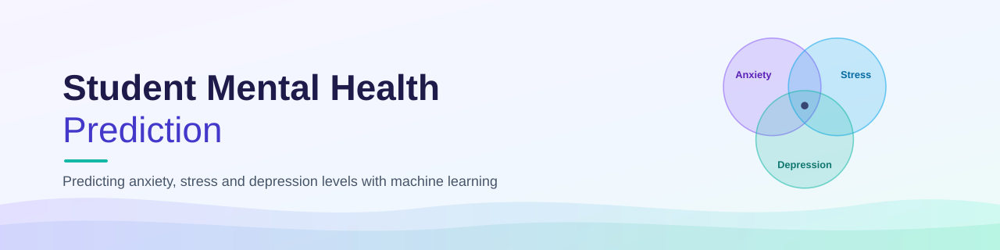
</p>

<p align="center">
  
  
  
  
</p>

<p align="center">
  <a href="https://colab.research.google.com/github/k-a-tha/Student-Mental-Health-Prediction/blob/main/mental_health_prediction.ipynb">
    
  </a>
</p>

<p align="center">
  Predicting university students' <b>anxiety</b>, <b>stress</b> and <b>depression</b> levels from survey data
  using KNN, Logistic Regression, a Neural Network and K-Means clustering.<br>
  Project for <b>CSE422: Artificial Intelligence</b> at <b>BRAC University</b>.
</p>

<p align="center">
  <a href="#-overview">Overview</a> •
  <a href="#-dataset">Dataset</a> •
  <a href="#-data-insights">Insights</a> •
  <a href="#-methodology">Methodology</a> •
  <a href="#-results">Results</a> •
  <a href="#-conclusion">Conclusion</a> •
  <a href="#-getting-started">Getting Started</a>
</p>

---

## 🧭 Overview

Mental-health screening usually needs a counsellor to score a full questionnaire by hand. This project asks a simple question:

> **Can a student's background and their answers on two mental-health scales predict their level on the third?**

If so, a university could flag students who may benefit from support much sooner. The dataset uses three standard screening scales:

| Scale | Measures | Questions | Target levels |
|-------|----------|:---------:|---------------|
| **GAD-7** | Anxiety | 7 | Minimal · Mild · Moderate · Severe |
| **PSS-10** | Perceived stress | 10 | Low · Moderate · High |
| **PHQ-9** | Depression | 9 | None · Minimal · Mild · Moderate · Moderately Severe · Severe |

Each target is a named level rather than a continuous number, so this is a **multi-class classification** problem. That is also why Linear Regression was not used.

> ⚠️ These are survey-based **screening levels, not clinical diagnoses**. The models are intended as an early-screening aid, never as a replacement for professional assessment.

---

## 📁 Dataset

| Property | Value |
|----------|-------|
| Data points | **1,977 students** |
| Original columns | 37 |
| Demographic fields | 5 categorical — Age, Gender, Academic Year, CGPA, Scholarship |
| Question fields | 26 numeric responses |
| Total-score fields | 3 numeric totals |
| Outputs | 3 categorical labels (4 anxiety, 3 stress, 6 depression classes) |
| Problem type | Multi-class classification |

### Class imbalance

The classes are far from equal, so a model could look accurate just by always guessing the largest class. Each target's **majority-class baseline** shows the accuracy of that naive strategy, and every result is compared against its own baseline.

| Target | Classes | Class counts (largest → smallest) | Imbalance ratio | Baseline |
|--------|:-------:|-----------------------------------|:---------------:|:--------:|
| Anxiety | 4 | 714 / 610 / 495 / 158 | 4.5 : 1 | 0.361 |
| Stress | 3 | 1316 / 546 / 115 | 11.4 : 1 | 0.666 |
| Depression | 6 | 495 / 488 / 449 / 408 / 93 / 44 | 11.2 : 1 | 0.250 |

Stress is the most imbalanced: *Moderate Stress* alone covers about two thirds of students.

<p align="center">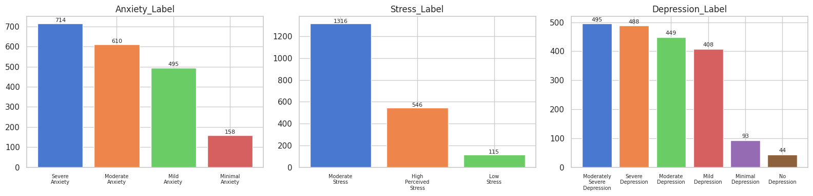</p>

**Source:** the publicly available **MHP (Anxiety, Stress, Depression) Dataset of University Students** — [figshare](https://figshare.com/articles/dataset/MHP_Anxiety_Stress_Depression_Dataset_of_University_Students/25771164) · paper: *A comprehensive standardized dataset on Mental Health Problems (MHPs) of University Students* ([ResearchGate](https://www.researchgate.net/publication/380638187_A_comprehensive_standardized_dataset_on_Mental_Health_Problems_MHPs_of_University_Students)). All credit for the data belongs to its original authors; the copy here (`Depression Data.csv`) is included only so the notebook runs as-is.

---

## 🔍 Data Insights

### Correlation analysis

- The **depression total is strongly correlated with the anxiety total (≈ 0.77)** and moderately with the stress total (≈ 0.58).
- Most **demographic correlations are close to zero**.
- So the mental-health scales carry most of the predictive signal, while background information alone is much weaker.

<p align="center">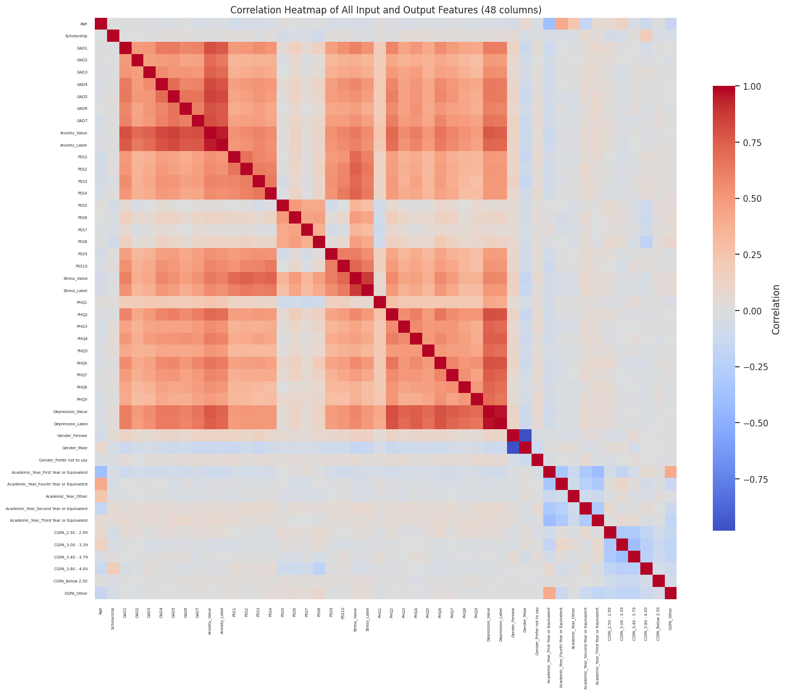</p>

### Exploratory data analysis

- **Anxiety scores rise steadily** as depression becomes more severe.
- **Stress scores also rise** across depression levels, though less steeply.
- **Gender and academic year** show much flatter differences, making them weak predictors on their own.

<p align="center">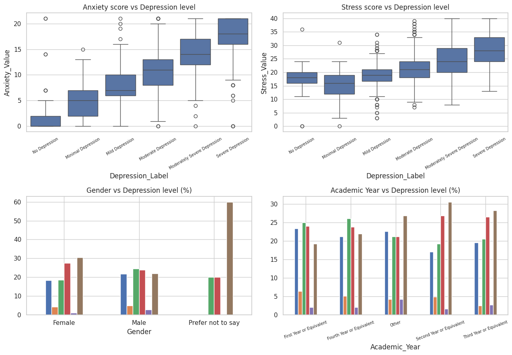</p>

---

## 🔬 Methodology

```text
Survey data (1,977 students · 37 columns)
        │
        ▼
Exploratory analysis ── correlations · class balance · boxplots
        │
        ▼
Pre-processing ── impute missing Gender · encode categories · (scaling after split)
        │
        ▼
Leakage removal ── drop the target scale's own questions, its total and all labels
        │
        ▼
Stratified 80 / 20 split ──► StandardScaler fitted on training data only
        │
        ▼
Models ── KNN · Logistic Regression · Neural Network · K-Means (unsupervised)
        │
        ▼
Evaluation ── accuracy · precision · recall · confusion matrix · ROC-AUC · ARI
```

### Pre-processing: three problems, three solutions

| Problem | Solution |
|---------|----------|
| **Missing values** — 6 missing, all in *Gender* | Filled with the mode (*Male*, 1,369 records), keeping all 1,977 students instead of deleting rows |
| **Categorical text** — models can't compute with text | *Age* mapped in its real order; *Scholarship* to No = 0 / Yes = 1; *Gender*, *Academic Year* and *CGPA* one-hot encoded (the last two include an *Other* category with no safe rank). 37 columns → **48 numeric columns** |
| **Different scales** — questions range 0–4, totals up to 21 / 40 / 27 | `StandardScaler` (mean 0, std 1), **fitted on the training set only** so no test information leaks into training |

<details>
<summary><b>Missing values chart</b></summary>
<br>
<p align="center">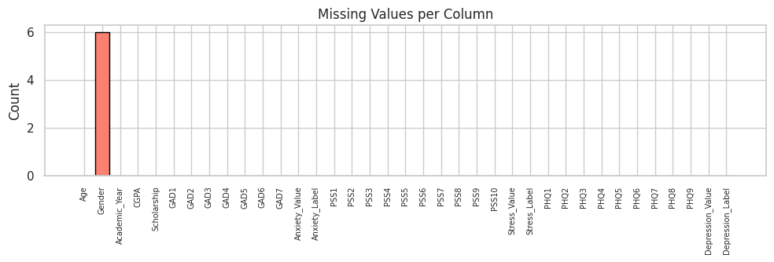</p>
</details>

### Preventing data leakage
For every student, each scale's total is exactly the **sum of its own questions**, and its label is a range cut of that total. Leaving those columns in would hand the model the answer. So when predicting a target, that scale's questions and total are removed, and **all three label columns are excluded** from every feature set.

### Train / test split
- **Stratified 80 / 20 split**: 1,581 training and 396 test records, with class proportions preserved.
- `random_state = 42` makes the experiment repeatable.
- Final feature counts: **37** for Anxiety, **34** for Stress, **35** for Depression. They differ because each target's own questions are removed.

### Models

| Model | Configuration | Why |
|-------|---------------|-----|
| **K-Nearest Neighbours** | `k = 15` | Odd k from 1 to 31 were tested; test accuracy stabilised after about k = 10 |
| **Logistic Regression** | `max_iter = 1000` | A clearly different, linear probabilistic approach to KNN |
| **Neural Network** | Dense(64, ReLU) → Dropout(0.3) → Dense(32, ReLU) → Softmax · Adam · sparse categorical cross-entropy · 40 epochs · batch 32 · 15% validation | Can learn non-linear patterns |
| **K-Means** | k = 6 (one per depression level) · PCA to 2-D for plotting | Unsupervised check for natural groups |

Naive Bayes was not chosen because the questionnaire features are strongly related, which breaks its independence assumption.

<details>
<summary><b>KNN: choosing k</b></summary>
<br>
<p align="center">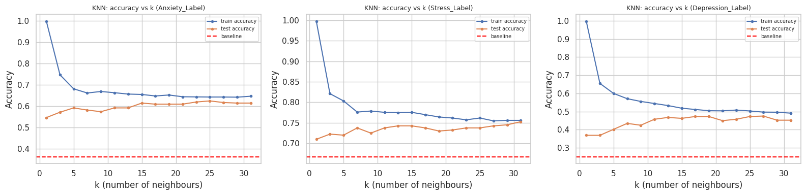</p>
</details>

---

## 📊 Results

Every model **beat its majority-class baseline** on every target. **Logistic Regression** was the most reliable model overall.

| Target | Baseline | KNN | Logistic Regression | Neural Network | Best AUC (LR) |
|--------|:--------:|:---:|:-------------------:|:--------------:|:-------------:|
| **Anxiety** | 0.361 | **0.614** | **0.614** | **0.614** | 0.851 |
| **Stress** | 0.667 | 0.742 | **0.788** | 0.753 | 0.860 |
| **Depression** | 0.250 | 0.462 | **0.530** | 0.470 | 0.821 |

<sub>Test-set accuracy. AUC is macro-averaged one-vs-rest ROC-AUC.</sub>

<p align="center">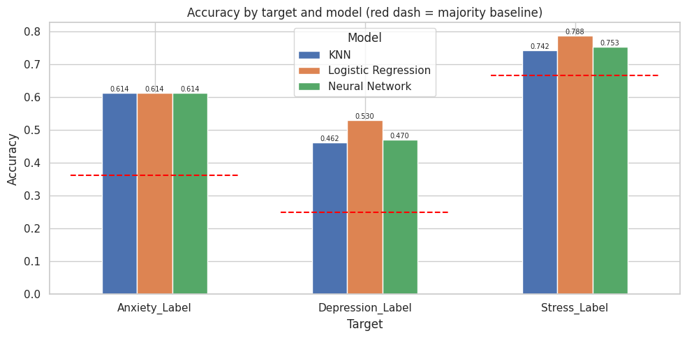</p>

<details>
<summary><b>Full metrics — accuracy, weighted precision and recall</b></summary>
<br>

| Target | Model | Accuracy | Precision | Recall |
|--------|-------|:--------:|:---------:|:------:|
| Anxiety | KNN | 0.614 | **0.635** | 0.614 |
| Anxiety | Logistic Regression | 0.614 | 0.607 | 0.614 |
| Anxiety | Neural Network | 0.614 | 0.614 | 0.614 |
| Stress | KNN | 0.742 | 0.753 | 0.742 |
| Stress | Logistic Regression | **0.788** | **0.776** | **0.788** |
| Stress | Neural Network | 0.753 | 0.742 | 0.753 |
| Depression | KNN | 0.462 | 0.460 | 0.462 |
| Depression | Logistic Regression | **0.530** | **0.521** | **0.530** |
| Depression | Neural Network | 0.470 | 0.458 | 0.470 |

Weighted recall equals accuracy here because every record has exactly one true class.

<p align="center">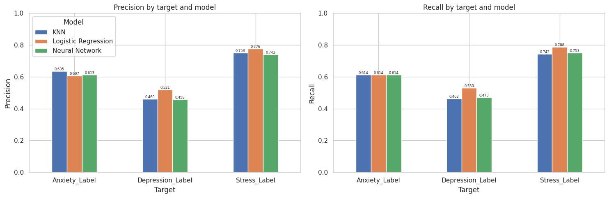</p>
</details>

### Generalisation: train vs test accuracy

| Model | Anxiety (train → test) | Stress (train → test) | Depression (train → test) |
|-------|:----------------------:|:---------------------:|:-------------------------:|
| KNN | 0.654 → 0.614 | 0.776 → 0.742 | 0.518 → 0.462 |
| Logistic Regression | 0.665 → 0.614 | 0.769 → 0.788 | 0.517 → 0.530 |
| Neural Network | **0.788 → 0.614** | **0.856 → 0.753** | **0.654 → 0.470** |

Logistic Regression's train and test scores stay close, so it generalises well. The **Neural Network overfits**: its training accuracy keeps rising while validation flattens, and dropout reduces but doesn't remove the gap.

<details>
<summary><b>Neural network learning curves</b></summary>
<br>
<p align="center">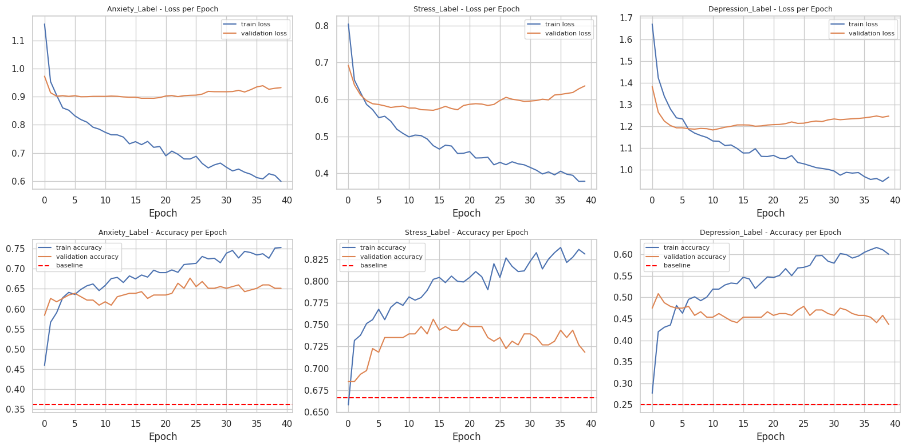</p>
</details>

### Where the models make mistakes
Most errors happen **between neighbouring severity levels** (e.g. *Mild* vs *Moderate*). That's expected, because the levels are cut from continuous questionnaire totals. The smallest groups, especially *No Depression* and *Minimal Depression*, are the hardest to predict.

<details>
<summary><b>Confusion matrices — every model on every target</b></summary>
<br>
<p align="center">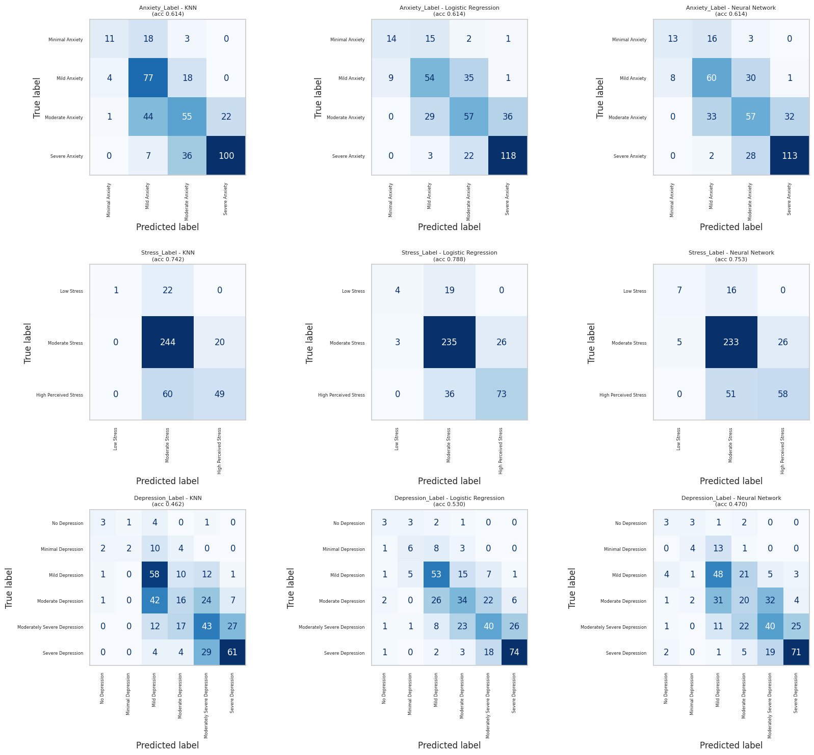</p>
</details>

### ROC curves and AUC
All AUC values fall between **0.796 and 0.860**, well above random guessing (0.500). Logistic Regression has the highest AUC on all three targets, so the models learned useful ranking information even when the exact level was hard to pin down.

<p align="center">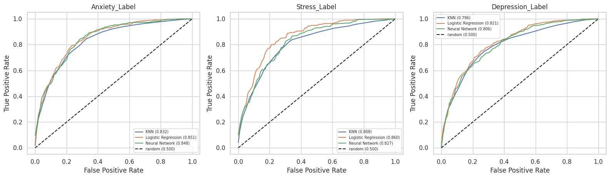</p>

### Unsupervised: K-Means
K-Means grouped students by overall similarity, ignoring the labels. Its **Adjusted Rand Index was only 0.130** (1 = perfect match, 0 = chance), so natural clusters overlap only weakly with the depression levels. The elbow curve shows no sharp turn at k = 6; six was chosen purely to compare against the six known levels.

<p align="center">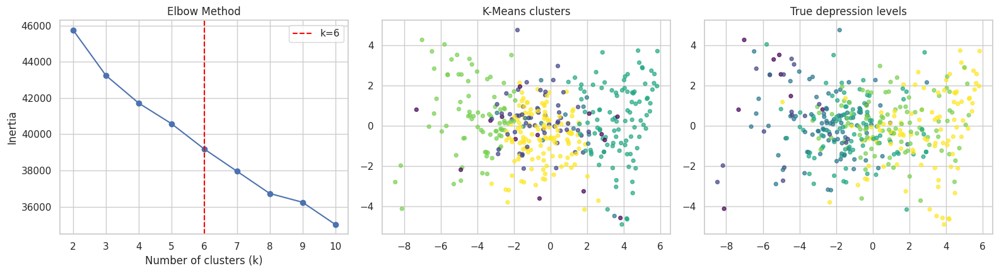</p>

---

## 🧾 Conclusion

**Results**
- Every supervised model beat its own baseline on all three targets.
- **Logistic Regression** was the most reliable model, with the best accuracy for Stress (0.788) and Depression (0.530) and the best AUC on all three targets.
- KNN also performed above baseline and tied for the best Anxiety accuracy.
- The Neural Network learned useful patterns but overfitted more than the other models.

**Why it works**
1. The three mental-health scales are strongly related, especially anxiety and depression.
2. Anxiety and stress scores rise with depression severity.
3. Every AUC is between 0.796 and 0.860, clearly above chance.
4. K-Means' low ARI (0.130) shows the levels aren't natural clusters, but supervised models can still learn them.

Related symptom scores are useful for predicting another mental-health level, while demographics alone contribute much less.

**Challenges**
- Handling the missing *Gender* values without discarding students.
- Choosing the right encoding for ordered, binary and unordered categories.
- Preventing leakage: removing each target's own questions and total, excluding all labels, and fitting the scaler on training data only.
- Interpreting imbalanced multi-class results using baselines, weighted metrics, confusion matrices and AUC.

📄 The complete write-up is in the **[project report (PDF)](report/CSE422_Mental_Health_Project_Report.pdf)**.

---

## 🚀 Getting Started

### Option 1 — Google Colab (easiest)
1. Click the **Open in Colab** badge at the top.
2. Upload `Depression Data.csv` from this repo to the Colab session (📁 panel on the left), or place it in `My Drive/Colab Notebooks/`.
3. Run all cells: **Runtime → Run all**.

### Option 2 — Run locally

```bash
git clone https://github.com/k-a-tha/Student-Mental-Health-Prediction.git
cd Student-Mental-Health-Prediction
pip install -r requirements.txt
jupyter notebook mental_health_prediction.ipynb
```

When running locally, **skip the Google Drive cell** (`drive.mount(...)`); the notebook then loads `Depression Data.csv` from the project folder automatically.

---

## 🗂️ Project Structure

```text
Student-Mental-Health-Prediction/
├── mental_health_prediction.ipynb     # full analysis, models and results
├── Depression Data.csv                # dataset (see Dataset section)
├── report/
│   └── CSE422_Mental_Health_Project_Report.pdf
├── assets/
│   ├── banner.svg
│   └── figures/                       # charts exported from the notebook
├── requirements.txt
├── LICENSE
└── README.md
```

## 🛠️ Tech Stack

| | |
|---|---|
| **Language** | Python 3 |
| **Data** | pandas · NumPy |
| **Visualisation** | Matplotlib · seaborn |
| **Machine learning** | scikit-learn — KNN, Logistic Regression, K-Means, PCA, metrics |
| **Deep learning** | TensorFlow / Keras |
| **Environment** | Jupyter Notebook · Google Colab |

## 👥 Authors

**Ridita Katha** ([@k-a-tha](https://github.com/k-a-tha)) and **Paromita Rasheed**

---

## 💙 A Note on Mental Health

This project is a technical exercise in machine learning. If you are a student feeling anxious, stressed or low, please reach out to your university's counselling service or someone you trust — support is available.

## 📄 License

**© 2026 Ridita Katha and Paromita Rasheed — All Rights Reserved.**

The code, notebook, report and figures may be viewed for reference, but may **not** be copied, modified, redistributed, or submitted as anyone else's work (including for coursework) without written permission from the authors. See [LICENSE](LICENSE) for details. The dataset remains the property of its original authors.
